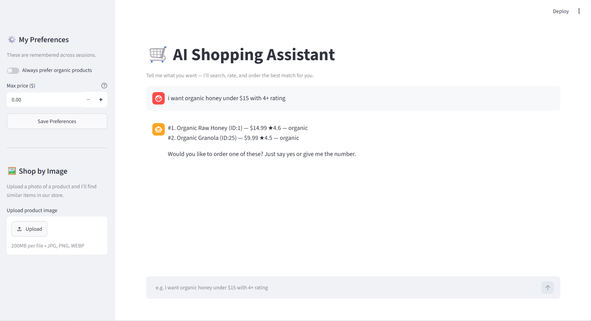
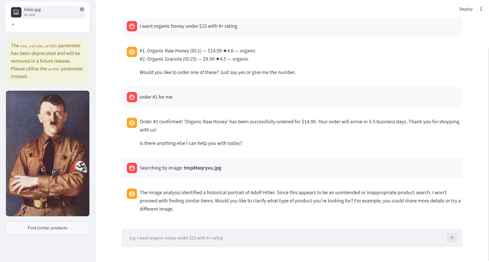

# 🛒 AI Shopping Assistant

An AI-powered shopping assistant built using LangChain, Groq LLMs, Streamlit, and SQLite.

The assistant helps users discover products, save shopping preferences, retrieve order history, place orders, and search products using uploaded images.

---


### Home Page

### Product Search 


## Features

### 🔍 Natural Language Product Search

Search products using conversational queries:

* I want organic honey under $20
* Show me highly rated coffee
* Recommend healthy snacks

### ⭐ Product Ratings & Reviews

The assistant retrieves product ratings and review counts before making recommendations.

### 💾 Persistent User Preferences

Save preferences such as:

* Prefer organic products
* Maximum budget
* Shopping habits

Preferences are stored in SQLite and reused across conversations.

### 📦 Order History

Users can:

* Place orders
* View previous purchases
* Retrieve order history through chat

### 🖼️ Image-Based Product Search

Upload a product image and the assistant:

1. Analyzes the image using a vision model
2. Identifies product characteristics
3. Searches the store for similar products

### 🛡️ Guardrails

A dedicated validation layer filters off-topic requests and keeps the assistant focused on shopping-related tasks.

---

## Tech Stack

* Python 3.13
* LangChain
* LangGraph Agent Framework
* Groq LLMs
* Streamlit
* SQLite
 


---

## Project Structure

AI_Shopping_Assistant/

├── .env.example

├── .gitignore

├── LICENSE

├── README.md

├── main.py

├── pyproject.toml

├── requirements.txt

├── uv.lock

│

└── Shopping_Agent/

    ├── app.py

    ├── ai_agent.py

    ├── create_db.py

    ├── guardrails.py

    ├── reviews_api.py

    └── store.db

---

## Run the Project

Create a `.env` file:

```env
GROQ_API_KEY=your_api_key_here
```

Install dependencies:

```bash
pip install -r requirements.txt
```

Run the application:

```bash
streamlit run Shopping_Agent/app.py
```

---

## What I Learned

* Building AI agents with LangChain
* Tool calling and agent workflows
* SQLite database integration
* Streamlit application development
* Guardrail implementation
* Persistent user preferences
* Vision-based product search
* Prompt engineering and agent design

---

## Future Improvements

* Shopping cart support
* Multi-user authentication
* Better recommendation ranking
* Semantic search using ChromaDB
* Review-based recommendation engine

---

## Author

ULISETTI SAKETH UZVAL KRISHNA
